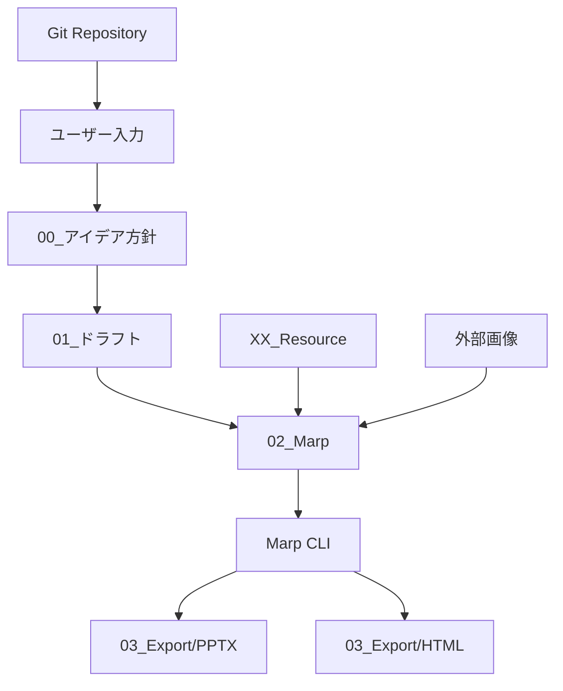

# ⚙️ 技術仕様書

## 🛠️ システム要件

### 必要なソフトウェア

#### Node.js環境
- **Node.js**: v14.0.0以上（推奨: v18.0.0以上）
- **npm**: v6.0.0以上（Node.jsに同梱）
- **OS**: Windows 10+, macOS 11+, Ubuntu 18.04+

#### Marp CLI
```bash
# グローバルインストール
npm install -g @marp-team/marp-cli

# バージョン確認
marp --version
```

#### Git環境
- **Git**: v2.20.0以上
- **推奨設定**: 
  ```bash
  git config --global core.autocrlf input  # 改行コード統一
  git config --global core.quotepath false # 日本語ファイル名対応
  ```

### ハードウェア要件

#### 最小要件
- **CPU**: 2コア以上
- **メモリ**: 4GB以上
- **ストレージ**: 1GB以上の空き容量

#### 推奨要件
- **CPU**: 4コア以上（Intel i5相当以上）
- **メモリ**: 8GB以上
- **ストレージ**: SSD 2GB以上の空き容量

---

## 🏗️ アーキテクチャ概要

### システム構成図



### データフロー
1. **企画段階**: 方針・アウトライン定義
2. **作成段階**: Markdownでのコンテンツ作成
3. **変換段階**: Marp形式への変換・スタイル適用
4. **出力段階**: PPTX・HTML形式でのエクスポート
5. **管理段階**: Gitによるバージョン管理

---

## 📁 ファイル形式・構造

### サポート形式

#### 入力形式
| 形式 | 用途 | 文字エンコーディング |
|------|------|---------------------|
| `.md` | Markdownコンテンツ | UTF-8 |
| `.css` | スタイルシート | UTF-8 |
| `.png/.jpg/.svg` | 画像ファイル | バイナリ |

#### 出力形式
| 形式 | 用途 | 特徴 |
|------|------|------|
| `.pptx` | PowerPoint形式 | 編集制限有、高い互換性 |
| `.html` | Web表示形式 | フル機能、ブラウザ依存 |
| `.pdf` | 印刷形式 | レイアウト固定、普遍性 |

### ディレクトリ構造詳細

```
claude-code-marp-slides/
├── 00_アイデア方針/              # 企画・方針ファイル
│   ├── [テーマ]_方針.md         # 作成方針（UTF-8）
│   └── [テーマ]_アウトライン.md  # 構成計画（UTF-8）
├── 01_ドラフト/                 # コンテンツドラフト
│   └── [テーマ].md             # Markdownドラフト（UTF-8）
├── 02_Marp/                    # Marp処理用ファイル
│   └── [テーマ].md             # Marpフォーマット（UTF-8）
├── 03_Export/                  # 出力ファイル
│   ├── PPTX/                   # PowerPoint形式
│   │   └── [テーマ].pptx       # バイナリ形式
│   └── HTML/                   # Web形式
│       └── [テーマ].html       # UTF-8エンコーディング
├── XX_Resource/                # リソース・設定
│   ├── template.css            # CSSスタイル（UTF-8）
│   ├── images/                 # 画像リソース
│   └── fonts/                  # フォントファイル
├── docs/                       # プロジェクトドキュメント
├── CLAUDE.md                   # プロジェクト設定（UTF-8）
└── .gitignore                  # Git除外設定
```

---

## 🔧 Marp CLI詳細設定

### 基本コマンド

#### PPTX出力
```bash
marp [入力ファイル] \
  --pptx \
  --output [出力パス] \
  --allow-local-files \
  --theme-set [カスタムテーマ]
```

#### HTML出力
```bash
marp [入力ファイル] \
  --html \
  --output [出力パス] \
  --allow-local-files \
  --theme-set [カスタムテーマ]
```

#### プレビューモード
```bash
marp [入力ファイル] \
  --preview \
  --theme-set [カスタムテーマ]
```

### 高度な設定

#### カスタムCSS適用
```bash
marp input.md \
  --theme-set custom.css \
  --pptx \
  --output output.pptx
```

#### 画像処理オプション
```bash
marp input.md \
  --image-scale 2.0 \        # 画像スケール調整
  --jpeg-quality 85 \        # JPEG品質設定
  --allow-local-files        # ローカルファイルアクセス許可
```

---

## 🎨 CSSスタイル設定

### フロントマター設定

#### 基本設定
```yaml
---
marp: true
theme: default
paginate: true
backgroundColor: #fff
---
```

#### 高度な設定
```yaml
---
marp: true
theme: default
paginate: true
backgroundColor: #fff
size: 16:9
header: 'プレゼンテーションタイトル'
footer: '作成者名'
style: |
  section {
    font-family: 'Hiragino Kaku Gothic ProN', sans-serif;
    font-size: 22px;
    padding: 40px 50px;
  }
---
```

### カスタムスタイル

#### セクション設定
```css
section {
  /* レイアウト */
  width: 1280px;
  height: 720px;
  padding: 40px 50px;
  
  /* フォント */
  font-family: 'Hiragino Kaku Gothic ProN', 'メイリオ', sans-serif;
  font-size: 22px;
  line-height: 1.6;
  
  /* 色彩 */
  background-color: #ffffff;
  color: #333333;
}
```

#### 見出しスタイル
```css
h1 {
  position: absolute;
  top: 20px;
  left: 170px;
  font-size: 32px;
  color: #2c5aa0;
  font-weight: bold;
}

h2 {
  font-size: 28px;
  color: #2c5aa0;
  margin-bottom: 20px;
}

h3 {
  font-size: 24px;
  color: #333333;
  margin-bottom: 15px;
}
```

---

## 🖼️ 画像処理・管理

### サポート画像形式

#### 推奨形式
| 形式 | 用途 | 最大サイズ | 推奨解像度 |
|------|------|-----------|------------|
| **PNG** | スクリーンショット、図表 | 5MB | 1920x1080 |
| **JPEG** | 写真、背景画像 | 3MB | 1920x1080 |
| **SVG** | アイコン、ロゴ | 1MB | ベクター |
| **WebP** | 高圧縮画像 | 2MB | 1920x1080 |

#### 最適化設定
```bash
# ImageMagickを使用した最適化例
convert input.jpg -quality 85 -resize 1920x1080 output.jpg
```

### 画像配置記法

#### 背景画像
```markdown
<!-- 全面背景 -->


<!-- サイズ・位置指定 -->


<!-- 複数画像 -->


```

#### 調整パラメータ
| パラメータ | 構文 | 値の範囲 | 効果 |
|------------|------|----------|------|
| 明度 | `brightness:0.6` | 0.0-2.0 | 画像の明るさ調整 |
| コントラスト | `contrast:1.2` | 0.0-2.0 | コントラスト調整 |
| ぼかし | `blur:2px` | 0px-20px | ぼかし効果 |
| 透明度 | `opacity:0.8` | 0.0-1.0 | 透明度設定 |

---

## 📊 パフォーマンス最適化

### ファイルサイズ管理

#### 目標値
- **Markdownファイル**: 200KB以下
- **CSSファイル**: 50KB以下
- **画像ファイル**: 1-5MB（個別）
- **出力PPTX**: 20MB以下
- **出力HTML**: 10MB以下

#### 最適化手法
1. **画像圧縮**: 適切な形式・品質設定
2. **CSS最適化**: 不要なスタイル削除
3. **フォント最適化**: ウェブフォント選択的読み込み

### 処理時間目安

#### 標準的なスライド（20ページ）
- **PPTX生成**: 30-60秒
- **HTML生成**: 10-20秒
- **プレビュー起動**: 5-10秒

#### 大規模スライド（50ページ以上）
- **PPTX生成**: 2-5分
- **HTML生成**: 30-60秒
- **メモリ使用量**: 500MB-1GB

---

## 🔐 セキュリティ・プライバシー

### データ保護

#### ローカルデータ
- **暗号化**: Gitリポジトリは平文管理
- **バックアップ**: 定期的なリポジトリバックアップ推奨
- **アクセス制御**: ファイルシステムレベルでの権限管理

#### 外部リソース
- **画像**: Unsplashなどの商用利用可能ソース
- **フォント**: システムフォント優先、ウェブフォント注意
- **API**: 外部APIアクセスなし（完全ローカル処理）

### 機密情報管理
- **コミット前チェック**: 機密情報の混入防止
- **.gitignore設定**: 一時ファイル・機密ファイル除外
- **履歴管理**: 機密情報のコミット履歴確認

---

## 🧪 テスト・品質保証

### 自動テスト

#### Marp CLI テスト
```bash
# 構文チェック
marp --dry-run input.md

# 出力テスト
marp input.md --pptx --output test.pptx
marp input.md --html --output test.html
```

#### 品質チェックスクリプト
```bash
#!/bin/bash
# quality-check.sh

echo "=== Marp Quality Check ==="

# 1. ファイル存在確認
echo "Checking file structure..."
test -f "02_Marp/$1.md" || exit 1

# 2. Markdown構文チェック
echo "Checking Markdown syntax..."
marp --dry-run "02_Marp/$1.md" || exit 1

# 3. 出力テスト
echo "Testing PPTX export..."
marp "02_Marp/$1.md" --pptx --output "test.pptx" || exit 1

echo "Testing HTML export..."
marp "02_Marp/$1.md" --html --output "test.html" || exit 1

echo "Quality check passed!"
```

### 手動テスト項目

#### 視覚的品質
- [ ] フォントの正常表示
- [ ] 画像の適切な配置
- [ ] レイアウト統一性
- [ ] 色彩の正確性

#### 機能テスト
- [ ] スライド遷移の正常動作
- [ ] ハイパーリンクの動作
- [ ] 印刷時の表示確認
- [ ] 複数ブラウザでの表示確認

---

## 🔄 CI/CD・自動化

### Git Hooks設定

#### Pre-commit Hook
```bash
#!/bin/bash
# .git/hooks/pre-commit

echo "Running pre-commit checks..."

# Markdownファイルの構文チェック
for file in $(git diff --cached --name-only --diff-filter=ACM | grep '\.md$'); do
    echo "Checking $file..."
    marp --dry-run "$file" || exit 1
done

echo "Pre-commit checks passed!"
```

#### 自動ビルド（GitHub Actions例）
```yaml
name: Build Slides
on:
  push:
    branches: [ main ]
    paths: [ '02_Marp/**' ]

jobs:
  build:
    runs-on: ubuntu-latest
    steps:
    - uses: actions/checkout@v3
    - uses: actions/setup-node@v3
      with:
        node-version: '18'
    - run: npm install -g @marp-team/marp-cli
    - run: ./scripts/build-all.sh
    - uses: actions/upload-artifact@v3
      with:
        name: slides
        path: 03_Export/
```

---

## 📋 トラブルシューティング

### 一般的な問題

#### 1. Marp CLI インストール失敗
```bash
# 権限エラーの場合
sudo npm install -g @marp-team/marp-cli

# Node.js バージョンが古い場合
nvm install 18
nvm use 18
npm install -g @marp-team/marp-cli
```

#### 2. 画像が表示されない
```bash
# ローカルファイルアクセス許可
marp input.md --allow-local-files --pptx

# パス確認
ls -la images/  # 画像ファイル存在確認
```

#### 3. 日本語フォントが表示されない
```css
/* フォールバック設定 */
font-family: 'Hiragino Kaku Gothic ProN', 'Yu Gothic', 'Meiryo', sans-serif;
```

#### 4. PPTX生成でタイムアウト
```bash
# メモリ制限解除
node --max-old-space-size=4096 $(which marp) input.md --pptx
```

### ログ・デバッグ

#### 詳細ログ出力
```bash
marp input.md --pptx --verbose
```

#### デバッグモード
```bash
DEBUG=marp* marp input.md --pptx
```

---

## 📊 システム監視・メトリクス

### パフォーマンス指標
- **ビルド時間**: スライドあたりの生成時間
- **ファイルサイズ**: 出力ファイルのサイズ推移
- **エラー率**: ビルド失敗の頻度
- **リソース使用量**: CPU・メモリ使用量

### 品質指標
- **一貫性スコア**: デザインガイドライン遵守率
- **可読性スコア**: フォントサイズ・コントラスト適合率
- **アクセシビリティスコア**: WCAG準拠率

---

*この技術仕様書は、システムの理解と効率的な運用を支援し、高品質なプレゼンテーション作成環境の構築に貢献します。*