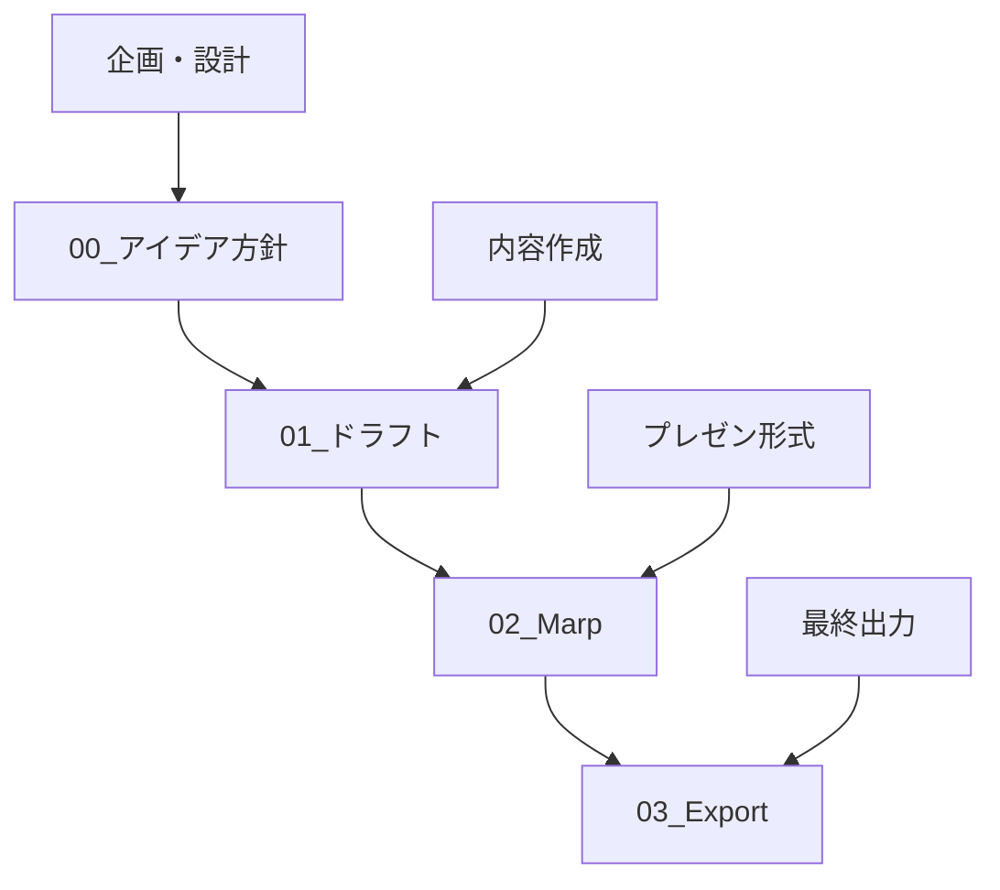

# 📋 ワークフロー詳細ガイド

## 🎯 4段階プロセス概要

Claude Code Marp Slidesプロジェクトは、効率的で一貫性のあるスライド作成を実現するため、以下の4段階プロセスを採用しています。



---

## 📋 Stage 0: アイデア方針（企画・設計）

### 目的
- スライドの方向性と目標を明確化
- ターゲットオーディエンスの定義
- 構成とアウトラインの策定

### 作成ファイル

#### `[テーマ]_方針.md`
```markdown
# [テーマ]スライドの作成方針

## 1. 作成目的とターゲット設定
### 目的
- 明確な目標設定
- 期待される成果の定義

### ターゲット
- 主要オーディエンス
- 副次オーディエンス
- 想定される知識レベル

## 2. スライド構成の方針
### ページ数・構成比率
### 情報の信頼性基準
### コンテンツの重点ポイント

## 3. 視覚的デザインの方針
### 画像・図表の活用
### レイアウト原則

## 4. 期待される成果
```

#### `[テーマ]_アウトライン.md`
```markdown
# [テーマ]スライドのアウトライン

## スライド構成（全XX ページ予定）

### 1. 導入部（X ページ）
1. **表紙**
2. **目次**
3. **話すこと・話さないこと**

### 2. 主要セクション1（X ページ）
### 3. 主要セクション2（X ページ）
### 4. まとめ・展望（X ページ）

## 各スライドの詳細要素
- 含めるべき要素
- スライド間の連携
```

### 品質チェックポイント
- [ ] 目的とターゲットが明確に定義されている
- [ ] 構成とページ数が適切に計画されている
- [ ] 情報源と信頼性基準が設定されている
- [ ] デザイン方針が統一されている

---

## ✏️ Stage 1: ドラフト（内容作成）

### 目的
- 通常のMarkdown形式でコンテンツを作成
- 情報の整理と論理構成の確立
- 必要な調査・リサーチの実施

### ファイル構造
```markdown
# [テーマ]のタイトル
## サブタイトル

---

## 目次
1. セクション1
2. セクション2
3. セクション3

---

## このスライドで話すこと・話さないこと

### 話すこと ✓
- 具体的なポイント1
- 具体的なポイント2

### 話さないこと ✗
- 除外する内容1
- 除外する内容2

---

## セクション1のタイトル

### 詳細内容
- 箇条書き項目
- 具体的データ
- 事例・エビデンス

### 統計・数値データ
- 数値1: XX%
- 数値2: XX億円
- 期間: XXXX年-XXXX年

---
```

### 作成ガイドライン

#### コンテンツ要件
1. **具体性**: 抽象的説明よりも具体的事例・数値を重視
2. **信頼性**: 情報源を明確化、最新データを使用
3. **論理性**: セクション間の論理的つながりを確保
4. **完全性**: 1スライド1メッセージの原則で完結した内容

#### 情報収集方針
- **一次情報**: 公式発表、統計データ、企業発表
- **信頼できる二次情報**: 業界レポート、専門メディア
- **最新性**: 2024-2025年の情報を優先
- **多角的視点**: 複数の情報源からの検証

### 品質チェックポイント
- [ ] 方針.mdの要件を満たしている
- [ ] 各セクションが論理的に構成されている
- [ ] 具体的なデータ・事例が含まれている
- [ ] ターゲットに適した内容レベルになっている
- [ ] 情報源が信頼できるものである

---

## 🎨 Stage 2: Marp（プレゼンテーション形式）

### 目的
- ドラフトをMarp形式に変換
- 視覚的デザインの適用
- プレゼンテーション用の構成調整

### フロントマター設定
```yaml
---
marp: true
theme: default
paginate: true
backgroundColor: #fff
style: |
  section {
    font-family: 'Hiragino Kaku Gothic ProN', 'メイリオ', sans-serif;
    padding: 40px 50px 40px 50px;
    font-size: 22px;
  }
  h1 {
    position: absolute;
    top: 20px;
    left: 170px;
    font-size: 32px;
    color: #333;
  }
  h2 {
    font-size: 28px;
    color: #2c5aa0;
    margin-bottom: 20px;
  }
  ul {
    font-size: 20px;
    line-height: 1.6;
  }
  .title-slide h1 {
    position: static;
    text-align: center;
    font-size: 36px;
    margin-top: 150px;
  }
  .title-slide h2 {
    text-align: center;
    font-size: 24px;
    color: #666;
    margin-top: 30px;
  }
  footer {
    position: absolute;
    bottom: 10px;
    right: 20px;
    font-size: 12px;
    color: #666;
  }
---
```

### スライド分割原則

#### 基本ルール
1. **1スライド1メッセージ**: 各スライドは1つの明確なメッセージ
2. **適切な情報量**: 読みやすい情報密度を維持
3. **論理的順序**: 自然な流れでの情報提示

#### 分割タイミング
- 新しい主要セクションの開始
- 情報が多すぎる場合（箇条書き7項目以上など）
- 異なる概念・事例の説明
- 強調すべきポイントの独立表示

### スタイリング手法

#### 特殊スライドの指定
```markdown
<!-- _class: title-slide -->
# タイトルスライド

<!-- _style: "padding-bottom: 45px;" -->
# 内容が多いスライド

<!-- _backgroundColor: "#f0f0f0" -->
# 背景色変更スライド
```

#### 画像・背景の挿入
```markdown

# 右側背景画像付きスライド


# 全面背景画像スライド
```

### レイアウト調整

#### 確認すべきポイント
1. **目次ページ**: 項目数による枠はみ出し
2. **長いリスト**: 箇条書きの表示調整
3. **コードブロック**: 長いコードの表示
4. **フッター重複**: ロゴとの重なり

#### 調整方法
- `padding-bottom`の個別調整
- コンテンツの複数スライド分割
- フォントサイズの動的調整

### 品質チェックポイント
- [ ] スライド分割が適切である
- [ ] フロントマターが正しく設定されている
- [ ] スタイリングが統一されている
- [ ] 画像・背景が適切に配置されている
- [ ] レイアウトの問題がない

---

## 📤 Stage 3: Export（最終出力）

### 目的
- PPTX・HTML形式での最終出力
- 品質確認とテスト
- 配布可能な形式での提供

### エクスポートコマンド

#### PPTX形式
```bash
marp 02_Marp/[テーマ].md --pptx --output 03_Export/PPTX/[テーマ].pptx --allow-local-files
```

#### HTML形式
```bash
marp 02_Marp/[テーマ].md --html --output 03_Export/HTML/[テーマ].html --allow-local-files
```

### 出力形式の特徴

| 形式 | 用途 | 特徴 | 編集可能性 |
|------|------|------|------------|
| **PPTX** | 正式プレゼン | PowerPoint互換 | 限定的 |
| **HTML** | Web表示・共有 | ブラウザ対応 | 不可 |

### 品質確認プロセス

#### PPTX確認項目
- [ ] PowerPointで正常に開ける
- [ ] フォントが適切に表示される
- [ ] 画像が正しく配置されている
- [ ] スライド遷移が正常
- [ ] ページ番号が表示されている

#### HTML確認項目
- [ ] 主要ブラウザで正常表示
- [ ] レスポンシブデザイン対応
- [ ] キーボードナビゲーション
- [ ] 印刷時の表示確認

### トラブルシューティング

#### 一般的な問題
1. **画像が表示されない**
   - `--allow-local-files`オプションの追加
   - 画像パスの確認

2. **フォントが正しく表示されない**
   - システムフォントの確認
   - フォールバック設定の確認

3. **レイアウトが崩れる**
   - スタイル設定の見直し
   - 内容量の調整

### 品質チェックポイント
- [ ] 両形式で正常に出力される
- [ ] 視覚的品質が担保されている
- [ ] 配布可能な状態である
- [ ] 必要に応じて編集方法が文書化されている

---

## 🔄 フォルダ間同期ルール

### 依存関係
```
00_アイデア方針 (設計)
    ↓ 反映
01_ドラフト (内容作成)
    ↓ 変換
02_Marp (プレゼン形式)
    ↓ エクスポート
03_Export (最終出力)
```

### 変更時の影響範囲

#### 00_アイデア方針の変更
- **影響範囲**: 全段階
- **対応**: 01→02→03の順次更新
- **確認事項**: 構成・方針の一貫性

#### 01_ドラフトの変更
- **影響範囲**: 02→03
- **重要変更**: 00への逆反映検討
- **軽微変更**: そのまま02に反映

#### 02_Marpの変更
- **影響範囲**: 03のみ
- **対応**: エクスポートの再実行
- **確認事項**: レイアウト・スタイル

### 同期確認プロセス
1. **変更検出**: `git status`での確認
2. **影響分析**: 依存関係の確認
3. **更新実行**: 必要な段階の更新
4. **品質確認**: 各段階での検証
5. **コミット**: 変更履歴の記録

---

## 📊 プロセス改善

### KPI指標
- **作成効率**: テーマあたりの作成時間
- **品質指標**: 修正回数・エラー発生率
- **再利用性**: テンプレート・手法の流用度
- **満足度**: 最終成果物の評価

### 継続的改善
1. **定期レビュー**: ワークフローの見直し
2. **ツール改善**: 自動化・効率化の検討
3. **品質向上**: チェックリストの更新
4. **知識共有**: ベストプラクティスの蓄積

### 今後の発展
- テンプレートの多様化
- 自動化スクリプトの開発
- 品質チェックの自動化
- 多言語対応の検討

---

*このワークフローは継続的に改善され、プロジェクトの成熟とともに進化します。*